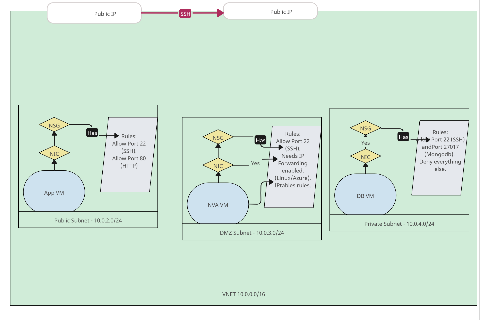

# Securing the Database with a 3 Subnet Architecture



## Overview

This guide outlines the steps to secure your database using a **3-subnet architecture** in Azure. The setup includes:
- A **public subnet** for the application VM.
- A **DMZ subnet** for the Network Virtual Appliance (NVA).
- A **private subnet** for the database VM.

The architecture ensures:
- Only the application VM has internet access.
- The database VM is isolated and accessible only through the NVA.
- Strict security rules are applied to minimise exposure.

<video controls src="../images-videos/Provision Page.mp4" title="Title"></video>

---

## Key Steps

1. **VNET Setup and Subnet Configuration** 
Provision three subnets: one for the database, one for the application, and one for the NVA.

2. **Deploy the Database VM**  
Deploy a VM that will host the database, ensuring it is placed in a subnet with restricted access.

3. **Deploy the Application VM**  
Deploy a VM for running the application, ensuring it can connect to both the database and the NVA.

4. **Test Connectivity Between VMs**  
Verify that the database and application VMs can communicate as expected before configuring the NVA.

5. **Deploy the NVA VM**  
Deploy a VM to act as the Network Virtual Appliance, responsible for routing and filtering traffic.

6. **Configure Route Tables**  
Modify route tables to ensure traffic between VMs is routed through the NVA.

7. **Enable IP Forwarding on the NVA**  
Enable IP forwarding to allow the NVA to route traffic between the database and application VMs.

8. **Set Up IP Table Rules**  
Configure IP table rules on the NVA to control and monitor traffic flows.

9. **Apply Stricter Security Rules for the Database VM**  
Harden the security settings of the database VM to restrict access to only the necessary sources.

---

Step 1: Setup VNET
------------------------------

- **Public Subnet**: Hosts the application VM with internet access.
- **DMZ Subnet**: Hosts the NVA VM for routing and firewall functionality.
- **Private Subnet**: Hosts the database VM with no public IP.

---

### Subnet Configuration Details
- **Virtual Network Name**: `tech501-amir-3-subnet-vnet`
- **Address**: 10.0.0.0/16
- **Subnets**:
  - **public-subnet**: 10.0.2.0/24 (for the application VM)
  - **private-subnet**: 10.0.4.0/24 (for the database VM, private access only)
  - **dmz-subnet**: 10.0.3.0/24 (for the NVA VM)
* * * * *

Step 2: Deploy the Database VM
------------------------------

### Configuration Details

Basic

-   **Select Image and Select Create VM**: tech501-amir-sparta-app-ready-to-run-db.

-   **VM Name**: tech501-amir-in-3-subnet-sparta-app-db-vm

-   **Availability Zone**: Zone 3

-   **SSH Key**: Type adminuser, use existing Azure Key stored in Azure and use your existing SSH key for access. `tech501-amir-az-key`

-   **Inbound Ports**: SSH 

-   **License Type**: Other

Disk

-   **Standard SSD** and select **Delete with VM**

Networking

-  **Virtual Network** tech501-amir-3-subnet-vnet

-   **Subnet**: private-subnet

-   **Disable Public IP - None**

-   **Delete NIC when VM is deleted**

Tags

- **Owner** **Amir**

Review and Create
* * * * *

Step 3: Deploy the Application VM
---------------------------------

### Configuration Details

-   **Select Image and Select Create VM**: tech501-amir-sparta-test-app-ready-to-run-app

-   **VM Name**: tech501-amir-in-3-subnet-sparta-app-vm

-   **Availability Zone**: Zone 1

-   **SSH Key**: Type adminuser, use existing Azure Key stored in Azure and use your existing SSH key for access. `tech501-amir-az-key`

-   **Inbound Ports**: SSH (port 22), HTTP(Port 80)

-   **License Type**: Other

Disk

-   **Standard SSD** and select **Delete with VM**

Networking

-  **Virtual Network**: tech501-amir-3-subnet-vnet

-   **Subnet**: public-subnet

-   **Public IP**: Enabled

-   **Delete Public IP and NIC when VM is deleted**

Advanced

-  **User Data**: 

```
#!/bin/bash

cd repo/app

export DB_HOST=mongodb://10.0.4.4:27017/posts

pm2 start app.js
```

For the export ip, go on the database VM on another window and scroll down on overview to find the private IP address.

Tags

- **Owner** **Amir**

Review and Create. Check if the public IP works and loads the Sparta Test APP posts page.

* * * * *

Step 4: Test Connectivity Between VMs
-------------------------------------

### Ping the Database VM from the Application VM

1) SSH into the App VM through Native SSH
```
ping 10.0.4.4
```

**Expected Output**:
```
64 bytes from 10.0.4.4: icmp_seq=1 ttl=64 time=0.5 ms
```

Will take a few minutes to complete. Create NVA while you wait.
* * * * *

Step 5: Deploy the NVA VM
-------------------------

### Configuration Details

-   No image required for the NVA VM

-   **VM Name**: tech501-amir-in-3-subnet-sparta-app-nva-vm

-   **Availability Zone**: Zone 2

-   **Image**: Ubuntu server 22.04 LTS x64 Gen2

-   **SSH Key**: Type adminuser, use existing Azure Key stored in Azure and use your existing SSH key for access. `tech501-amir-az-key`

-   **Inbound Ports**: SSH (port 22)

Disk

-   **Standard SSD** and select **Delete with VM**

Networking

-  **Virtual Network**: tech501-amir-3-subnet-vnet

-   **Subnet**: dmz-subnet

-   **Public IP**: Enabled

-   **Delete Public IP and NIC when VM is deleted**

Tags

- **Owner** **Amir**

Review and Create. Try again if you receive validation failed.

* * * * *

Step 6: Configure Route Tables
------------------------------

### Create a Route Table

-  **Region**: UK South

-  **Name**: tech501-amir-to-private-subnet-rt

-  **Propagate gateway routes**: Yes

-  **Tags**: Owner + Amir

Review and Create.

### Add and Associate Routes to the Route Table

-  **Settings > Routes > Add route**

-  **Route Name**: to-private-subnet-route

-  **Destination type**: IP Addresses

-  **Destination IP Addresses/CIDR**: 10.0.4.0/24

-  **Next hop type**: Virtual Appliance

-  **Next hop address**: 10.0.3.4 (Route traffic to private NVA IP address)

If you encounter errors adding routes go to **Settings > Subnets > Associate**

-  **Virtual Network**: tech501-amir-3-subnet-vnet (tech501)

-  **Subnet**: public-subnet


* * * * *

Step 7: Enable IP Forwarding on the NVA
---------------------------------------

### Enable IP Forwarding on the Azure Portal

Go to NVA's Network Interface Card

from **NVA VM > Network Settings > Network Interface/IP Configuration**: **Enable IP forwarding** and Apply.


### Enable IP Forwarding on the NVA VM (Linux)

SSH into the NVA VM and run:

To check if it's enabled use:
```
sysctl net.ipv4.ip_forward
```
If it did not enable it will respond with: `net.ipv4.ip_forward = 0`

```
sudo nano /etc/sysctl.conf
```
In order to set enable IP forwarding, set it to 1 by uncommenting `net.ipv4.ip_forward = 1`

Reload configuration file with
```
sudo sysctl -p
```

If you return to the App VM it will return to pinging again.
* * * * *

Step 8: Set Up IP Table Rules
-----------------------------

### Configure IP Tables on the NVA VM

Creating a bash script that will load up all our IP table rules (Time Efficient):

**Disclaimer**: The wrong IP table/firewall rules or rules setup in the wrong order, can possibly lock yourself out your VM.

SSH into the NVA VM and run:
```
nano config-ip-tables.sh
```
Refer to [config-script](config-ip-tables.sh) and give executable permissions with `chmod +x config-ip-tables.sh`. 

As the APP VM sends packets/traffic (ping) to the NVA, everything is getting forwarded on to the DB VM. The IP tables rules filters traffic according to the rules.

**Best practice**: Double-check load page works before testing script and run:
```
./config-ip-tables.sh
```
* * * * *

Step 9: Apply Stricter Security Rules for the Database VM
---------------------------------------------------------

Setting up stricter rules so only mongo DB and SSH will be accepted. Everything else will be denied. No other traffic will be let through on the NSG on the DB VM.

### Restrict SSH Access

Go to **Azure portal > Database VM > Network Settings > NSG > Inbound rules**

Edit SSH rule

-  **Source**: Select SSH only from trusted **IP addresses**

-  **Source IP/CIDR**: 10.0.2.0/24

-  **Service**: MongoDB

-  **Action**: Allow

-   Update the Network Security Group (NSG) rules in Azure to enforce this.

### Deny Everything Else Rule

Add New rule

Any other traffic from any other source, going to any other port will be denied.

-  Change destination port to an `*`

-  **Action**: Deny

-  **Priority**: Make it a higher priority like 1000.
* * * * *

Conclusion
----------

By following this guide, you have successfully set up a secure 3-subnet architecture in Azure. The database VM is now isolated, and all traffic is routed through the NVA for added security. Make sure to regularly review and update your security rules to maintain a robust defense against potential threats.